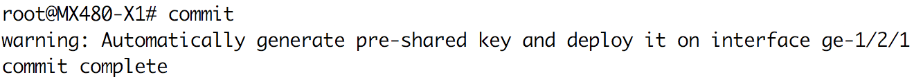

# User Guide

## Requirement: 
### Minimum requirements

* 2 juniper devices which supporting [MACsec functionality](https://apps.juniper.net/feature-explorer/search.html#q=MACsec)
* Management network connectivities among all devices

### For remote central server installation:
* 1 Linux server which has ability to executing python.
* Management network connectivity among devices and server
 
### Tested environment

* Device model: MX480
* Junos Version: JUNOS 17.3R1.10
* Line card model: MIC-3D-20GE-SFP-E

## Introduction:

* As [architecture diagram](#archi) shown, this tool would have a script(`remote_master.py`) running as a server and the other script(`local_minion.py`) running as a client.

* Module `remote_master.py`:
    * It's allow to running on linux server or juniper device.
    * it's designed as central storage of all MACsec pre-shared keys.

* Module `local_minion.py`:
    * It's only allow to execute on top of juniper device
    * it's designed for deploy MACsec keys to local device. For any device which require automatic MACsec key exchange would have to equipped with this script.

* Execution mode:
    * [On-box mode](#onbox-installation):
        * In this mode, `remote_server.py` would running on top of juniper device, in other words, one of the juniper device in user's environemnt would acting as a server 
        * In the same time, `local_minion.py` would also executing on all the juniper devices(including the same one acting as a server.) in user's environment.

    * [Off-box mode](#offbox-installation):
        * In this mode, `remote_server.py` would running on top of any linux server in user's environment, as a central storage.
        * In the same time, `local_minion.py` would execute on all the juniper devices in user's environment.

## Installation:

<a name="onbox-installation"></a>    
### On-box mode:

0. Download folder `MACsec_master_dependencies` to `/var/db/scripts/op` on thr juniper device which is going to acting as server.
1. Download `remote_master.py`, `master_environment.yaml` to `/var/db/scripts/op` on the juniper device which is going to acting as server.
2. Download folder `MACsec_minion_dependencies` to `/var/db/scripts/commit` on all juniper device.
3. Download `local_minion.py` and `minion_environment.yaml` to `/var/db/scripts/commit` on all juniper device.
4. Download `delete_MACsec_interface.py` to `/var/db/scripts/op` on all juniper devices
5. Editing `master_envionment.yaml`:
    
    ```
    MACSEC:
      INCLUDE_PATH: "./MACsec_master_dependencies"
      LOCAL_DB_FILE_PATH: "./MLS_data.pdl"
      LOG_PATH: "./AutoMACsec.log"  

    Production:
      SERVER_IP: "172.27.169.153"
      SERVER_PORT: "8888"
    ```
    * `INCLUDE_PATH` is the field which indicate where the `MACsec_master_dependencies` located
    * `LOCAL_DB_FILE_PATH` is the field which indicate where should database file located
    * `LOG_PATH` is the field which indicate where should log being stored at.
    * `SERVER_IP` is IP address of the device which `remote_master.py` would running at.
    * `SERVER_PORT` is the port which allow `remote_master.py` to accept/response HTTP requests.
    
6. Editing `minion_environment.yaml`:
    
    ```
    MACSEC:
      INCLUDE_PATH: ./MACsec_minion_dependencies"
      LOG_PATH: "./AutoMACsec.log"  
    
    Production:
      SERVER_IP: "172.27.169.122"
      SERVER_PORT: "8888"
    ```
    * `INCLUDE_PATH` is the field which indicate where the `MACsec_minion_dependencies` located
    * `LOG_PATH` is the field which indicate where should log being stored at.
    * `SERVER_IP` is IP address of the device which `remote_master.py` would running at.
    * `SERVER_PORT` is the port which allow `remote_master.py` to accept/response HTTP requests.

7. Deploy base config `BaseConfigs/OnBox/Onbox_remote_master_Basic.conf` to juniper device which acting as sever.
8. Deploy base config `BaseConfigs/OnBox/Onbox_local_minion_Basic.conf` to all juniper devices.

<a name="offbox-installation"></a>    
### Off-box mode:

0. Create a folder `MACsec_remote_master` on linux server
1. Download folder `MACsec_master_dependencies` to folder `MACsec_remote_master` on linux server
2. Download `remote_master.py` and `master_environment.yaml` to folder `MACsec_remote_master` on linux server
3. Download folder `MACsec_minion_dependencies` to `/var/db/scripts/commit` on all juniper devices
4. Download `local_minion.py`, `minion_environment.yaml` to `/var/db/scripts/commit` on all juniper devices
5. Download `delete_MACsec_interface.py` to `/var/db/scripts/op` on all juniper devices 
6. Editing `master_envionment.yaml`:
    
    ```
    MACSEC:
      INCLUDE_PATH: "./MACsec_master_dependencies"
      LOCAL_DB_FILE_PATH: "./MLS_data.pdl"
      LOG_PATH: "./AutoMACsec.log"  

    Production:
      SERVER_IP: "172.27.169.122"
      SERVER_PORT: "8888"
    ```
    * `INCLUDE_PATH` is the field which indicate where the `MACsec_master_dependencies` located
    * `LOCAL_DB_FILE_PATH` is the field which indicate where should database file located
    * `LOG_PATH` is the field which indicate where should log being stored at.
    * `SERVER_IP` is IP address of the device which `remote_master.py` would running at.
    * `SERVER_PORT` is the port which allow `remote_master.py` to accept/response HTTP requests.
    
7. Editing `minion_environment.yaml`:
    
    ```
    MACSEC:
      INCLUDE_PATH: ./MACsec_minion_dependencies"
      LOG_PATH: "./AutoMACsec.log"  
    
    Production:
      SERVER_IP: "172.27.169.122"
      SERVER_PORT: "8888"
    ```
    * `INCLUDE_PATH` is the field which indicate where the `MACsec_minion_dependencies` located
    * `LOG_PATH` is the field which indicate where should log being stored at.
    * `SERVER_IP` is IP address of the device which `remote_master.py` would running at.
    * `SERVER_PORT` is the port which allow `remote_master.py` to accept/response HTTP requests.
    
8. Deploy base config `BaseConfigs/OffBox/Offbox_local_minion_Basic.conf` to all juniper devices.

## Usage:

### On-box mode:

#### Remote master:
1. ssh to junos cli on juniper device which `remote_master` located.
2. Executing op script `remote_master.py`
```
lab@MX480X1b> op remote_master.py
```
3. The following message should show up, please leave the session here alive.
<br><br/>

<br><br/>

#### Local minion:
1. ssh to junos cli at each juniper device which `local_minion.py` located.
2. Edit macsec configuration as usual, but user doesn't have to configure pre-shared key.

    ```
    junos@MX# set security macsec interfaces <MACsec interface name> connectivity-association <user defined connectivity name>
    ```
    * Please make sure LLDP is up and running at all juniper devices and cabling are done correctly before commit.

3. Commit the configuration, `local_minion.py` would complete the configuration for you.

    ```
    junos@MX# commit
    ```
4. The output below should appear, which indicates key is automatically generated and deployed.
<br><br/>

<br><br/>

### Off-box mode:

#### Remote master:
1. ssh to linux server cli (Ubuntu 14.04 cli is shown here as example).
2. Go to the file path which `remote_master.py` located
3. Executing script `remote_master.py`
```
root@Ubuntu:~/python remote_master.py
```
3. The following message should show up, please leave the session here alive.
<br><br/>

<br><br/>
    * If user don't prefer to keep session terminal at all time, please take advantage on `screen` linux command.

#### Local minion:
1. ssh to junos cli at each juniper device which `local_minion.py` located.
2. Edit macsec configuration as usual, but user doesn't have to configure pre-shared key.

    ```
    junos@MX# set security macsec interfaces <MACsec interface name> connectivity-association <user defined connectivity name>
    ```
    * Please make sure LLDP is up and running at all juniper devices and cabling are done correctly before commit.

3. Commit the configuration, `local_minion.py` would complete the configuration for you.

    ```
    junos@MX# commit
    ```
4. The output below should appear, which indicates key is automatically generated and deployed.
<br><br/>

<br><br/>

### Monitoring pre-shared key pair at web page.
* You can always check `http://<remote_server_ip>:<port>` for current connection pre-shared key.


### Re-gen pre-shared key due to link issue (Wrong Cabling):
1. Ensure the device cabling is fixed.
2. Log into the device(s) which has new connection(s)
3. Execute op script `delete_MACsec_interface.py` for deleting specific interface pre-shared key

    ```
    junos@MX> op delete_MACsec_interface.py ChassisID <Device ChassisID> Interface <Device interface name>
    ```
4. Following output should appear to indicate delete action is done.


5. Delete orginal wrong MACsec configuration on specific interface
    
    ```
    junos@MX# delete security macsec interfaces <MACsec interface name>
    ```
    
6. Once again, edit macsec configuration as usual, don't have to configure pre-shared key.

    ```
    junos@MX# set security macsec interfaces <MACsec interface name> connectivity-association <user defined connectivity name>
    ```
    
7. Commit the configuration, commit script would auto-complete the key-exchange for you.
    
    ```
    junos@MX# commit
    ```

8. The output below should appear, which indicates key is automatically generated and deployed.
<br><br/>

<br><br/>

Architecture:
-------------
<a name="archi"></a>


