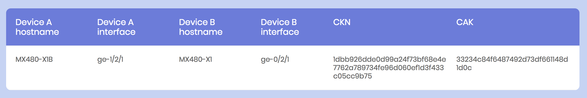

# User Guide

## Requirement: 
### Minimum requirements

* 2 juniper devices which supporting [MACsec functionality](https://apps.juniper.net/feature-explorer/search.html#q=MACsec)
* Management network connectivities among all devices

### For remote central server installation:
* 1 Linux server which has ability to executing python.
* Management network connectivity among devices and server
 
### Tested environment

* MX480
* JUNOS 17.3R1.10
* Line card model

## Introduction:

* As [architecture diagram](#archi) shown, this tool would have a script(`remote_master.py`) running as a server and the other script(`local_minion.py`) running as a client.

* Module `remote_master.py`:
    * It's allow to running on linux server or juniper device.
    * it's designed as central storage of all MACsec pre-shared keys.

* Module `local_minion.py`:
    * It's only allow to execute on top of juniper device
    * it's designed for deploy MACsec keys to local device. For any device which require automatic MACsec key exchange would have to equipped with this script.

* Execution mode:
    * On-box mode:
        * In this mode, `remote_server.py` would running on top of juniper device, in other words, one of the juniper device in user's environemnt would acting as a server 
        * In the same time, `local_minion.py` would also executing on all the juniper devices(including the same one acting as a server.) in user's environment.

    * Off-box mode:
        * In this mode, `remote_server.py` would running on top of any linux server in user's environment, as a central storage.
        * In the same time, `local_minion.py` would execute on all the juniper devices in user's environment.

## Installation:
### On-box mode:

0. Download all files located in `MACsec_master_dependencies` to `/var/db/scripts/op`
1. Download `remote_master.py` and `master_environment.yaml` to `/var/db/scripts/op`
2. Download all files located in `MACsec_minion_dependencies` to `/var/db/scripts/commit`
3. Download `local_minion.py` and `minion_environment.yaml` to `/var/db/scripts/commit`
4. Editing `master_envionment.yaml`:
    * 
5. 


### Remote Master
0. Download all dependency files located in `MACsec_master_dependencies` to local file path and configure the include path in `master_environment.yaml`
   <br> (e.g. For junos device, you can put dependency files on at `/var/db/script/jet/` )
1. For linux server, it's recommend to use screen for executing remote_master at background.

    ```
    root@server# screen
    ```
        
2. Executing `remote_master.py`
    
    ```
    root@server# python remote_master.py
    ```
        
### Local Minion
0. Deploy basic config Basic.conf at each junos devices.
1. Download all files in `MACsec_minion_dependencies` to include path, and configure the path in `minion_environment.yaml`
2. Download `local_minion.py` into `/var/db/scripts/commit/`

## Usage:

### Pre-shared key auto-gen & deployment:
0. Finish the cabling between all devices and make sure basic configuration are deployed.
1. Edit macsec configuration as usual, but user doesn't have to configure pre-shared key.

    ```
    junos@MX# set security macsec interfaces <MACsec interface name> connectivity-association <user defined connectivity name>
    ```
    
2. Commit the configuration, commit script would auto-complete the key-exchange for you.
    
    ```
    junos@MX# commit
    ```

3. You can always check `http://<remote_server_ip>:<port>` for current connection pre-shared key.



### Re-gen pre-shared key due to link issue (Wrong Cabling):
1. Ensure the device cabling is fixed.
2. Log into the device(s) which has new connection(s)
3. Execute op script `delete_MACsec_interface.py` for deleting specific interface pre-shared key

    ```
    op delete_MACsec_interface.py <Device ChassisID> <Device interface name>
    ```

4. Once again, edit macsec configuration as usual, don't have to configure pre-shared key.

    ```
    junos@MX# set security macsec interfaces <MACsec interface name> connectivity-association <user defined connectivity name>
    ```
    
5. Commit the configuration, commit script would auto-complete the key-exchange for you.
    
    ```
    junos@MX# commit
    ```
    
Architecture:
-------------
<a name="archi"></a>


